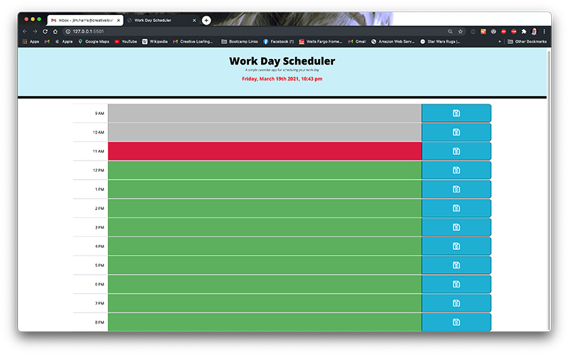
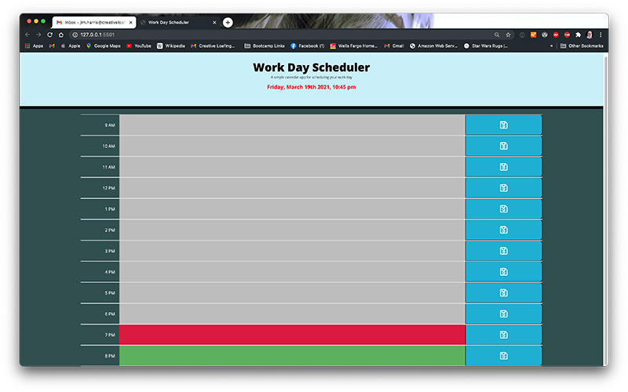
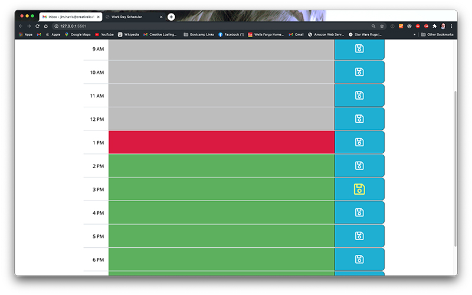
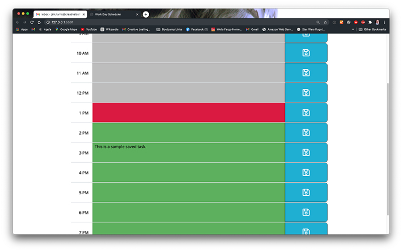
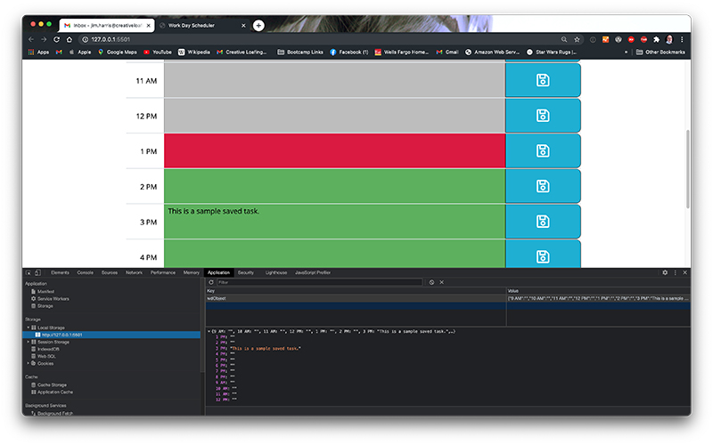
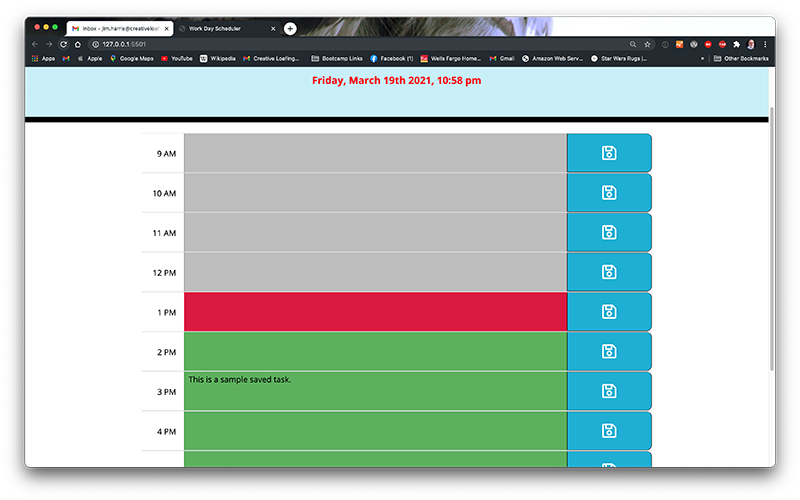

# Work Day Scheduler

## Description

The assignment was to build a simple calendar appplication that allowed users to enter and save events for each hour slot of the work day. The time and date features were to utilize the Moment.JS libraries. In addition to the Moment.JS utilization, the application was to feature dynamically updated HTML and CSS elements. All application features have been implemented with a few additions. The theme will change after 6 PM to a dark theme mode. It will automatically revert back to light mode after midnight. The page will also auto-refresh after 1 minute to update the current date string's time.

## Installation

My files can be accessed in the repository [HERE](https://github.com/arcangyl1963/workday-scheduler)
The image below shows the repository where my project files are located:

The web application can be viewed [HERE](https://arcangyl1963.github.io/workday-scheduler/).

The images below shows the various states of the Workday Scheduler Application: 

The first image shows the color keys for the task fields - grey is an hour in the past, red is the current hour, and green indicates a future hour yet to have occurred. This also features the light mode as the current hour is prior to the time set to trigger the theme change to dark mode.

The second image shows the color keys again, but with the dark mode theme displayed. The mode is set to trigger automatically at 6 PM by the automatic page refresh feature in the demo. This is fully customizable to the clients needs.

The third image highlights the Save icon's hover display feature. The icon enlarges and changes color when the cursor hovers over it. This is to make it easier for the user to insure they are targeting the save button on smaller screen devices.

The fourth image shows a task entry that has been saved to the task field.

The fifth image shows the task and time data sets saved to local storage.

The sixth images shows that the saved task information remains after the page has been auto-refreshed. (Note the time in the current date displayed has updated by one minute.)

© 2021 arcangyl studios